# Modern WoW Renderer

Modern WoW Renderer is a 32-bit Direct3D 9 proxy (`d3d9.dll`) that adds modern lighting, atmosphere, water, weather, and post-processing effects to the World of Warcraft client used by [Project Ascension](https://ascension.gg/).

> [!IMPORTANT]
> This project is developed and tested for the **Ascension client**. It is **not tested with a stock World of Warcraft 3.3.5 client**. The renderer is under active development, so visual glitches, compatibility problems, crashes, and performance regressions may still occur.

> [!WARNING]
> **AI Materials are not implemented as a supported feature yet.** The repository contains experimental material-cache code and configuration placeholders, but they are incomplete, disabled by default, and should not be treated as part of the current release.

## Screenshots

<table>
  <tr>
    <td>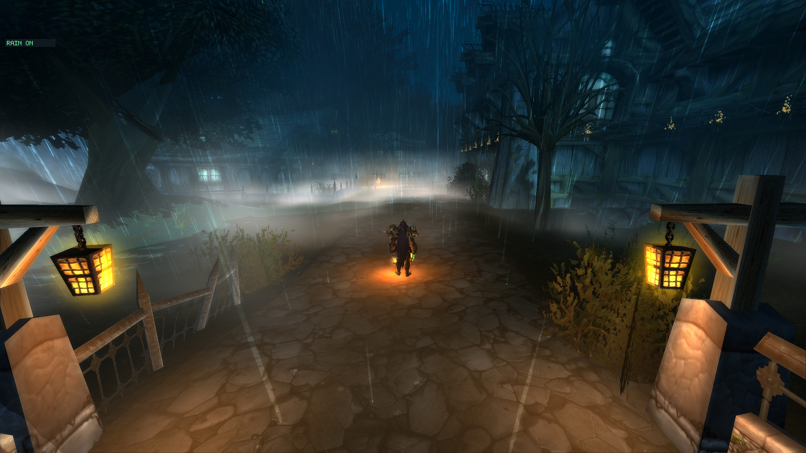</td>
    <td>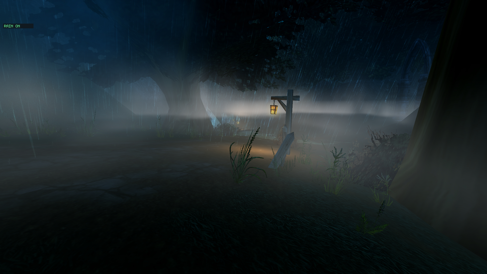</td>
  </tr>
  <tr>
    <td>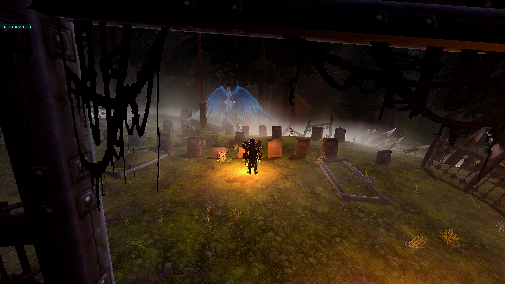</td>
    <td>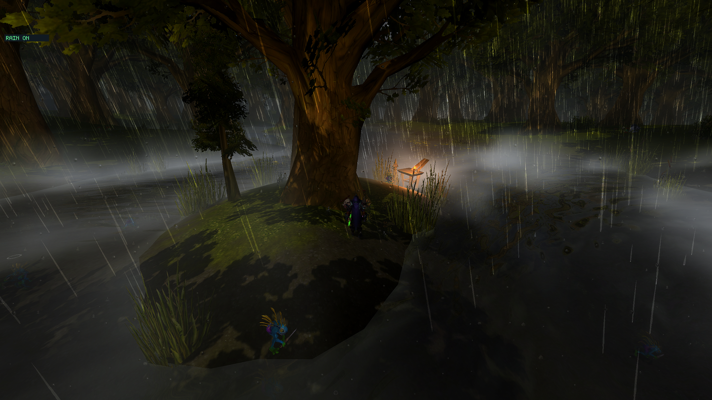</td>
  </tr>
  <tr>
    <td>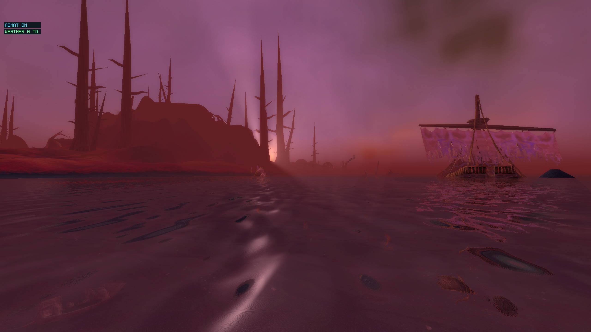</td>
    <td>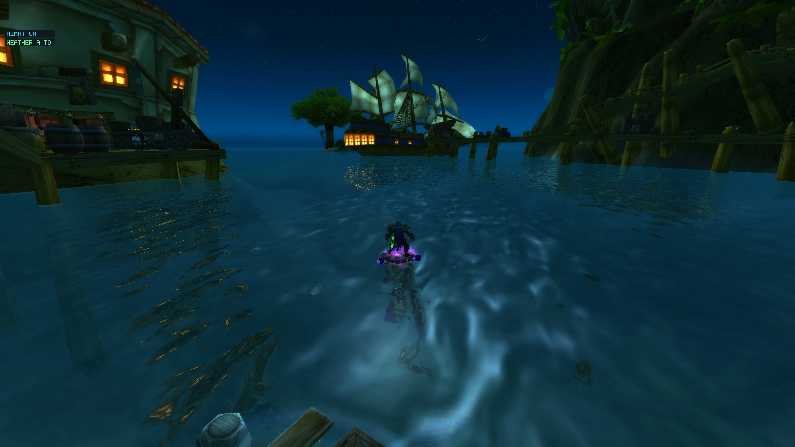</td>
  </tr>
  <tr>
    <td>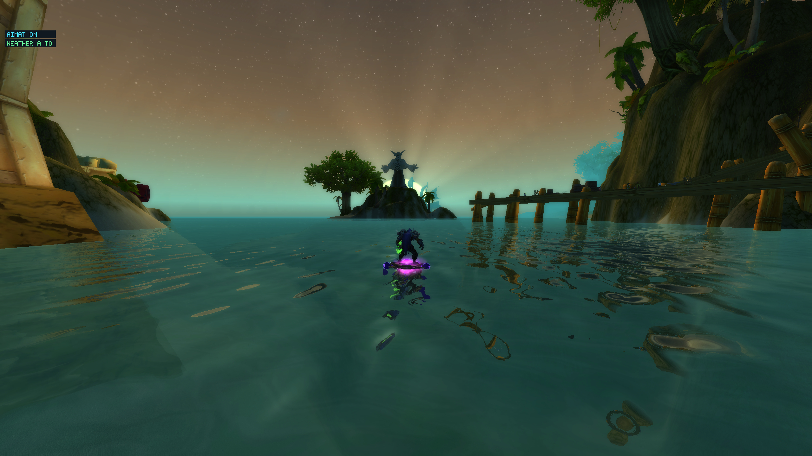</td>
    <td>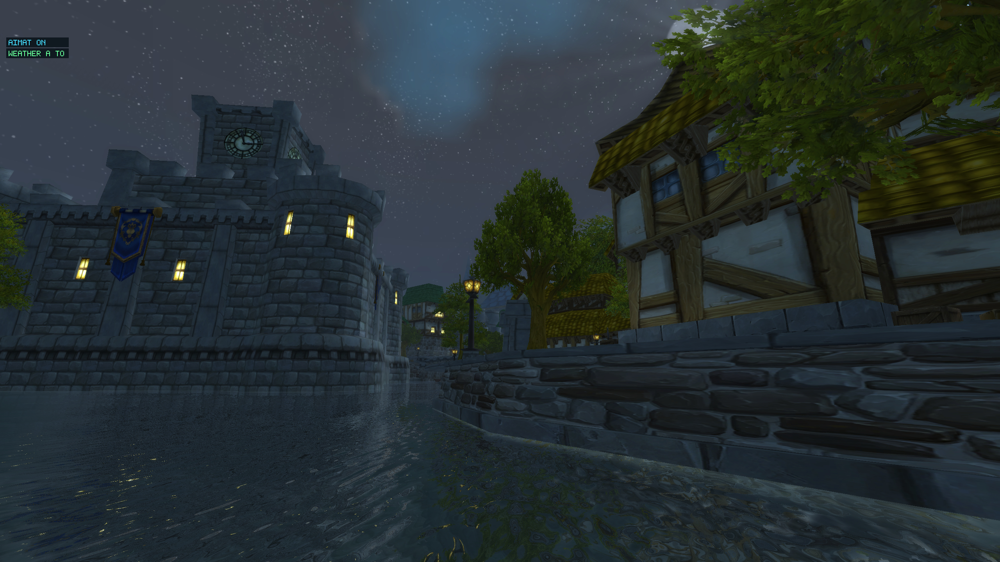</td>
  </tr>
  <tr>
    <td>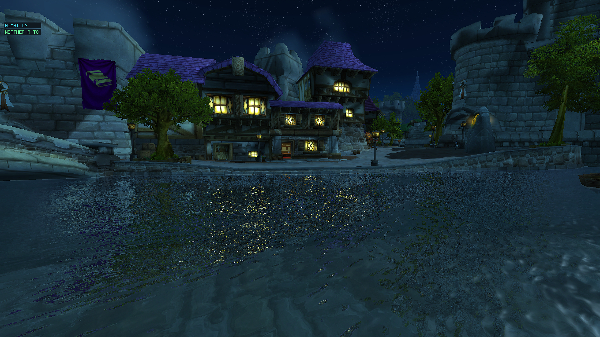</td>
    <td>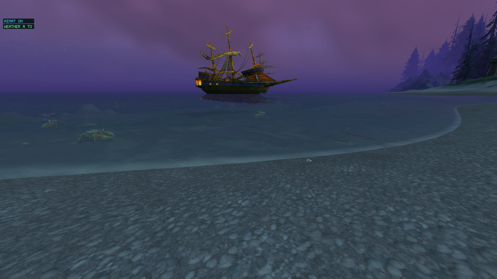</td>
  </tr>
  <tr>
    <td>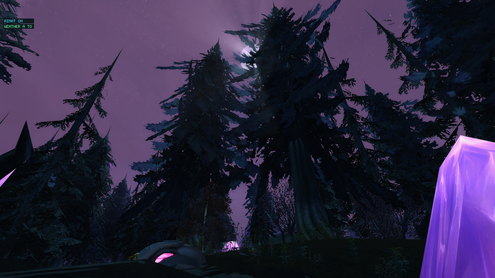</td>
    <td>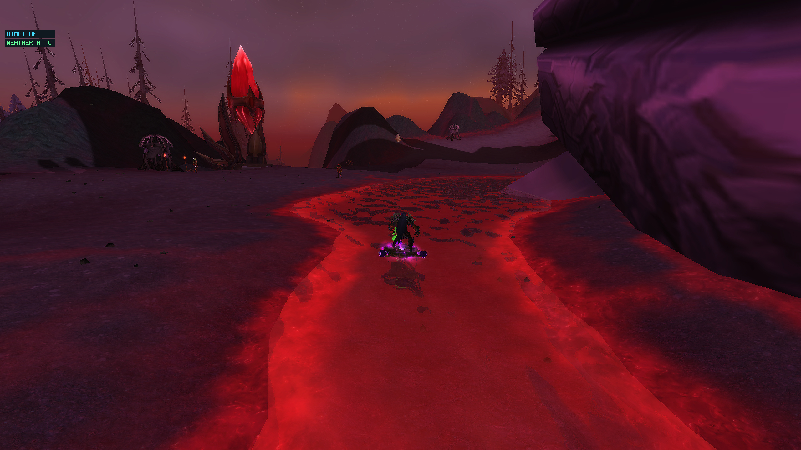</td>
  </tr>
  <tr>
    <td>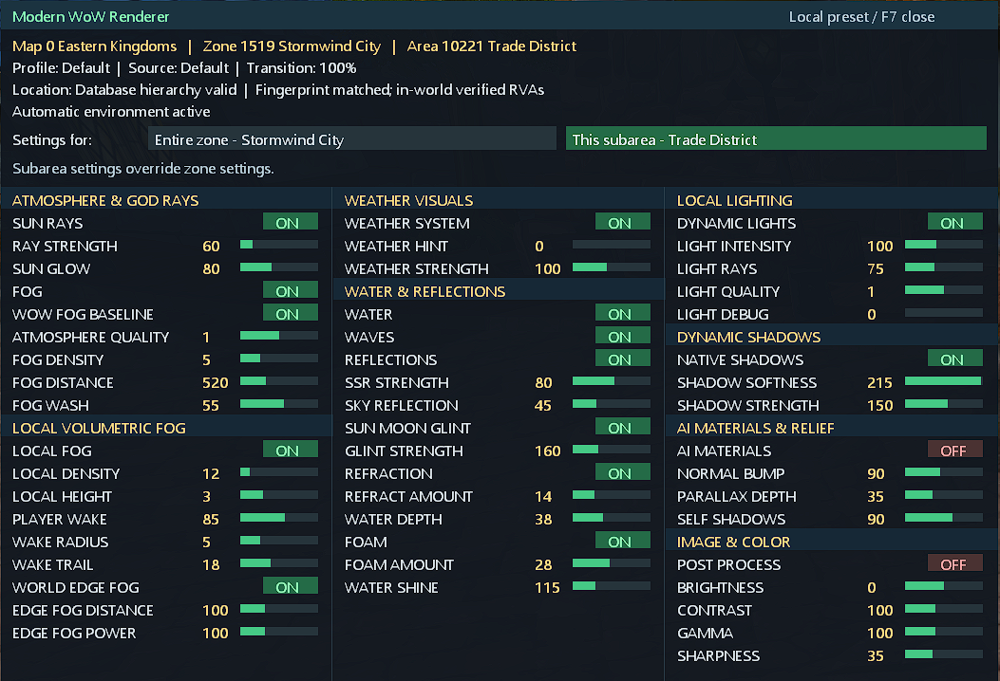</td>
    <td></td>
  </tr>
</table>

## Current features

### Atmosphere and volumetric lighting

- Depth-aware sun and moon shafts use the client's scene depth and tracked celestial direction.
- Height fog, aerial haze, ground mist, and animated terrain-relative local fog are integrated in world space.
- Local fog follows terrain, continues to evolve while the player is standing still, and reacts to player movement with a configurable wake.
- Temporal accumulation and edge-aware upsampling reduce noise without drawing over the interface.

### Dynamic environment lighting

- Trusted native point and spot lights can illuminate nearby world surfaces.
- Strong local lights contribute to volumetric scattering in fog and mist.
- Held torches and lanterns retain their light while the player briefly occludes the source from the camera.
- Screen-space occlusion and depth-derived normals keep the effect attached to visible geometry.

### Weather

- Native rain and snow receive replacement textures, intensity, speed, wind, and depth-occlusion controls.
- A depth-aware continuity layer keeps precipitation visible while moving quickly on a mount.
- Weather state survives short native-particle gaps caused by opening the F7 menu or returning from Alt+Tab.
- Optional rain lens droplets and an atmosphere-haze response are available.

### Water

- Screen-space reflections and environment fallback reflections.
- Refraction, depth absorption, shoreline foam, ripples, Fresnel response, and sun glint.
- Texture-signature matching covers liquid shader variants without splitting a continuous water surface.

### Native shadows and post-processing

- Softness and strength controls enhance the client-created cascaded shadow maps.
- Optional brightness, contrast, gamma, and sharpness post-processing.
- Native distance-fog controls remain available for compatibility with the client's own fog path.

## Known limitations

- AI Materials, generated normal maps, parallax relief, and material self-shadowing are still experimental and are not implemented as a supported release feature.
- Native-shadow enhancement only works when the Ascension client creates its own shadow maps.
- Dynamic lights and weather detection rely on observed Ascension render patterns; unusual zones, spells, addons, or future client updates can expose missed cases.
- D3D9 device resets, Alt+Tab transitions, uncommon depth formats, and third-party overlays remain compatibility-sensitive even though the common paths are covered by regression tests.
- This mod is in active development. Bugs are expected; include `ModernWoWRenderer.log`, the zone, and reproduction steps when reporting one.

## Controls

| Key | Action |
| --- | --- |
| `F7` | Open or close the grouped in-game tuning menu. |
| `F9` | Capture one diagnostic frame when celestial diagnostics are enabled. |
| `F10` | Toggle weather visuals. |
| `F11` | Toggle all injected graphics effects. |
| `F12` | Reload `GraphicsEffects.ini` without restarting the client. |

`F8` is reserved for the unfinished AI Materials development path and is not a supported user control.

F7 saves atmospheric, lighting, water and weather settings separately for each location. Select `Entire zone` to edit settings inherited by its subareas, or `This subarea` for a more specific override. Subarea values take priority over zone values. The `IMAGE & COLOR (GLOBAL)` block always uses the shared `GraphicsEffects.ini`, including the post-process toggle. Existing local color overrides are ignored.

Location presets automatically recognize the verified Ascension executable SHA-256 `e7c2a69cb86804eb9e21254b7b45c6a03e532d8b8f94451d9e0855f7535f97c6` when `[LocationProvider] ExeSHA256` is blank. Releases include `data/areas.txt`, exported from the verified client's loaded tables. Keep the `data` folder next to the DLL. Other executable versions need [environment setup and validation](docs/ENVIRONMENT-SYSTEM-RU.md). Unknown clients keep local presets locked; global image/color remains editable. Existing explicit client configurations are respected.

If F7 is locked, unresponsive, or fails to save, open F7 and reproduce the problem, then send `MenuDiagnostics.log` from the client directory with a screenshot. It records the build, executable hash, location validation, database status, viewport/client sizes, and save/render failures. It rotates at 1 MiB to `MenuDiagnostics.log.previous`. If no log exists, include `ModernWoWRenderer.log`. F12 reloads both settings and the area database; installing a new DLL requires restarting the game.

## Installation

1. Download the newest ZIP from [GitHub Releases](https://github.com/Corfirean/modern-wow-renderer/releases).
2. Extract its contents into the Ascension client directory, next to the game executable.
3. Confirm that `d3d9.dll`, `ModernWoWRenderer.ini`, and `GraphicsEffects.ini` are in that directory. Keep the packaged `textures` and `MaterialCache` directories beside them.
4. Start the client normally. Use `F7` to tune the effects and `F12` after editing `GraphicsEffects.ini` by hand.

Example layout:

```text
Ascension/
├── d3d9.dll
├── ModernWoWRenderer.ini
├── GraphicsEffects.ini
├── MaterialCache/
│   ├── local_light_manifest.json
│   └── LocalLightReview.json
└── textures/
    └── weather/
```

Remove or rename `d3d9.dll` to disable the proxy completely.

## Configuration

`ModernWoWRenderer.ini` contains proxy-wide switches, depth-capture preferences, and diagnostic controls. Most users should leave it unchanged.

`GraphicsEffects.ini` contains the live visual settings:

| Section | Purpose |
| --- | --- |
| `[Atmosphere]` | Volumetric quality, fog density, shafts, temporal filtering, and debug views. |
| `[LocalFog]` | Terrain-relative fog height, density, flow, and player wake. |
| `[DynamicLighting]` | Local-light intensity, volumetric contribution, quality, and debug modes. |
| `[WeatherVisuals]` | Rain/snow intensity, speed, wind, occlusion, lens droplets, and haze. |
| `[Water]` | Reflections, refraction, ripples, foam, absorption, Fresnel, and glint. |
| `[NativeShadows]` | Enhancement of the client's native shadow softness and strength. |
| `[PostProcess]` | Global enable switch, brightness, contrast, gamma, and sharpness. Always saved in `GraphicsEffects.ini`; location overrides are ignored. |
| `[DistanceFog]` | Scaling for the client's native distance fog. |
| `[AIMaterials]` | Unfinished experimental placeholder; keep disabled. |

The F7 overlay writes supported values back to `GraphicsEffects.ini`. Manual edits can be applied with `F12`.

## Building locally

Requirements:

- Visual Studio 2026 with the MSVC C++ x86/x64 tools and `v145` platform toolset.
- Windows SDK and MSBuild.
- A 32-bit `Win32` build target. The Ascension client is a 32-bit D3D9 process.

Build from a Visual Studio developer PowerShell:

```powershell
msbuild ModernWoWRenderer.sln /m /p:Configuration=Release /p:Platform=Win32 /p:PlatformToolset=v145
```

The installable output is written to `build\Release\`. The post-build step copies both INI files, the local-light manifests, and weather textures alongside `d3d9.dll`.

## Continuous integration and releases

`.github/workflows/build.yml` builds both Debug and Release configurations for every pull request targeting `main` and every push to `main`. It uses GitHub's `windows-2025-vs2026` image and verifies the DLL and both configuration files.

Every successful push to `main` also creates a GitHub Release containing an install-ready ZIP with:

- `d3d9.dll`
- `ModernWoWRenderer.ini`
- `GraphicsEffects.ini`
- `EnvironmentProfiles.ini` (location verification and environment configuration)
- required `MaterialCache` manifests
- packaged weather textures

The Release build is also retained as a workflow artifact for 14 days.

## Validation

The repository includes focused regression and shader checks:

```powershell
tools\Test-Atmosphere.cmd
powershell -ExecutionPolicy Bypass -File tools\ValidateShaders.ps1
```

The tests cover fog-field coverage and motion, weather continuity, held-light lifetime, depth-capture policies, and embedded shader compilation. Final visual verification still requires the Ascension client because these effects depend on its real draw order, shaders, textures, and device-reset behavior.

## Project structure

```text
ModernWoWRenderer.cpp        D3D9 proxy exports, hook dispatch, and frame orchestration
VolumeIntegration.h         Atmosphere and volumetric composition
WeatherVisuals.h            Native precipitation and continuity rendering
WaterEffect.h               Water replacement and shading
NativeShadowDiagnostics.h   Native cascade discovery and enhancement
TuningOverlay.h             F7 in-game settings interface
src/Core/                   Shared frame state, math, and shader caches
src/D3D9/                   Camera/depth capture and render-state guards
src/Effects/                Volumetric and local-light render passes
src/Lighting/               Trusted local-light collection and lifetime rules
src/Scene/                  Draw-call classification
src/Materials/              Experimental, unfinished AI Materials code
src/Diagnostics/            Runtime logging, capture, and profiling
tools/                      Offline regression and shader validation tools
Screenshots/                README gallery source images
```

The proxy loads the system Direct3D 9 runtime, forwards the normal API, observes Ascension's render state, and injects its passes before the user interface. It does not replace game data files or network behavior.

## Reporting bugs

Open a GitHub issue with:

- the Ascension client build and zone;
- the effect and settings involved;
- exact reproduction steps, including whether Alt+Tab, F7, a mount, or a device reset is involved;
- `ModernWoWRenderer.log` and a screenshot or short video when available.

Reports from stock 3.3.5 clients are still useful, but that client is currently outside the tested compatibility target.
